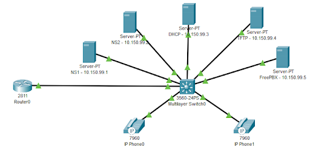

# Network Services Final Lab Automation with Ansible and Bash
**Purpose of this**: To automate the basic tasks I have to perform when entering my Network Services lab that take up a good bit of my lab time. This made it so I could focus mainly on completing the new content of the lab.

***Prerequisites***: 
- Need to know MAC addresses of VMs
- VMware Workstation Pro
- Rocky VM (Wired Connected)
- Router
- Switch

Follow the step-by-step instructions for setting up and utilizing the repo in `docs/main-setup.md`. As well as following the instructions in `docs/ntp-setup.md` and `docs/dnssec-setup.md` for setting up a NTP Server and DNSSEC.

### Diagram of the Final Lab that this repo helps complete:
