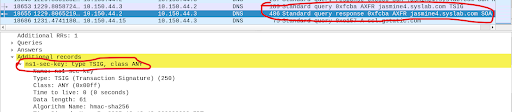

# Setting up DNSSEC
***This has already been implemented to a certain extent, you just need to generate your own key.***

## On Primary DNS VM:
dnssec-keygen -a HMAC-SHA256 -b 112 -n HOST ns1-ns2-key
Generates:
```sh
Kns1-ns2-key.+165+<random>.key
Kns1-ns2-key.+165+<random>.private
```

For report:
```sh
cat Kns1-ns2-key.+165+*.key
cat Kns1-ns2-key.+165+*.private
```


## In Primary DNS named.conf, add this key block at the top (use the actual key you got):
```sh
key "ns1-ns2-key" {
  algorithm hmac-sha256;
  secret "qwertyFakeBase64==";  // <-- use actual key here
};
```

## In Zone Declarations:
```sh
zone "jasmine4.syslab.com" IN {
    type master;
    file "jasmine4.syslab.com.dns";
    allow-transfer { 10.150.44.3; key ns1-ns2-key; };
    also-notify { 10.150.44.3; };
};


zone "44.150.10.in-addr.arpa" IN {
    type master;
    file "44.150.10.in-addr.arpa.dns";
    allow-transfer { 10.150.44.3; key ns1-ns2-key; };
    also-notify { 10.150.44.3; };
};
```

## In Secondary DNS named.conf:
```sh
zone "jasmine4.syslab.com" IN {
    type slave;
    file "bak.jasmine4.syslab.com.dns";
    masters { 10.150.44.2 key ns1-ns2-key; };
};

zone "44.150.10.in-addr.arpa" IN {
    type slave;
    file "bak.44.150.10.in-addr.arpa.dns";
    masters { 10.150.44.2 key ns1-ns2-key; };
};
```

## Testing it worked
On Secondary: rndc retransfer jasmine4.syslab.com
should see TSIG in Wireshark during the zone transfer:
Filter: dns and dns.tsig

#### Proof of it working:

