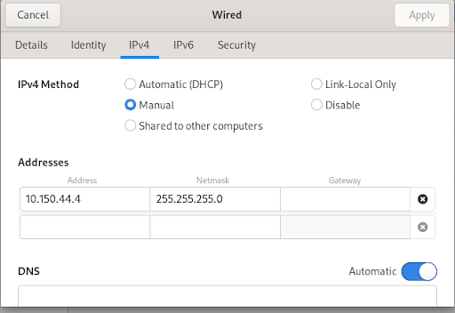
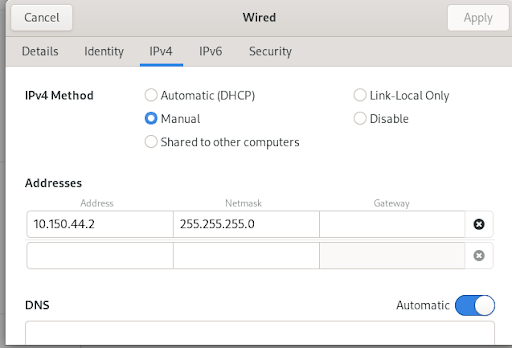
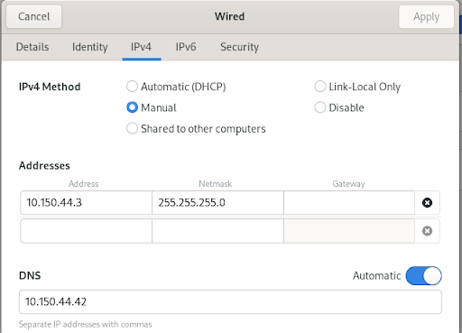

# Step-by-Step Guide for DHCP and DNS part of lab
***These are personal notes, not meant to be professional***
1. wired connected
2. clone the repo on a Rocky VM (not clone)
3. shutdown the VM (this VM will now be your client)
4. make linked clones of the VM
go into DHCP linked clone, and go into wired settings, and do the following (ALSO change the MAC addresses in the dhcpd.conf)



6. run the setup.sh with sudo privileges (should run successfully)
7. go into the Primary DNS linked clone, and go into wired settings, and do the following



8. run the setup.sh with sudo privileges (should run successfully)
9. go into the Secondary DNS linked clone, and go into wired settings, and do the following



10. run the setup.sh with sudo privileges (should run successfully)
11. change the wired settings in each (except DHCP) to be automatic DHCP
12. Do a “dhclient -r” followed by a “dhclient” then “ip a”
13. Run setup script in every VM except primary DNS, and type “6” for mounting resolv.conf

### Functionality of DHCP
For all the VMs except the DHCP server VM, go in and change the configuration from “Manual” to “Automatic (DHCP).” Move the wire from PC NIC -> DHCP. To being PC NIC -> Switch.

## Commands to do in Switch
```cisco
enable 
config t

vlan 10
interface range gi6/0/1-6
swithcport  mode access
switchport access vlan 10
exit

interface range gi6/0/1 - 6
spanning-tree portfast
exit


monitor session 1 source interface gi6/0/5
monitor session 1 destination interface gi6/0/1
```

## Commands to do in Router
```cisco
enable 
config t
int f0/1
ip addr 10.150.44.1 255.255.255.0
no shut
exit
```
