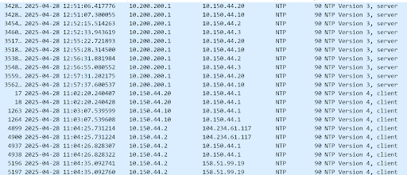

# Setting up the NTP Server
In router:
```cisco
interface f0/1
 ip address dhcp
 ip nat outside

interface f0/0
 ip address 10.150.44.1 255.255.255.0
 ip nat inside

access-list 1 permit 10.150.44.0 0.0.1.255
ip nat inside source list 1 interface f0/1 overload

clock timezone EST -5
clock summer-time EST recurring
ntp server 3.pool.ntp.org	OR	ntp server 129.6.15.28
```

## Verifying NTP
```cisco
show clock
show ntp associations
show ntp status
```
Then Filter in a Wireshark Capture on the network for `ntp`.

#### Proof of it working:

